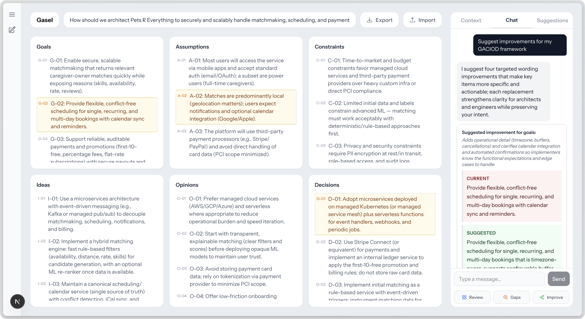

# Gasel



A research project on AI, Creativity, and design decision making at the University of California, Irvine. 

Gasel guides students through structured software-design analysis using Generative AI & the GACIOD Framework, created by Andre van der Hoek for the use of teaching Software Design I at UC Irvine. GACIOD stands for Goals, Assumptions, Constraints, Ideas, Opinions, and Decisions.

## Tech Stack

- **Framework**: Next.js 16 (App Router)
- **Database**: PostgreSQL on [Neon](https://neon.tech) with Drizzle ORM
- **Auth**: Neon Auth (email OTP)
- **AI**: OpenAI GPT-5-mini
- **Styling**: Tailwind CSS 4

## Features

- **GACIOD Matrix Management** — Create and manage structured analysis sessions with items across six categories
- **Four AI Interaction Modes**:
  - **Generate** — Create, update, or delete GACIOD items
  - **Insight** — Get feedback and analysis on your matrix
  - **Critique** — Identify gaps, conflicts, and weaknesses
  - **Improve** — Strengthen existing items with refined alternatives
- **Session Persistence** — All sessions, items, and chat history saved to PostgreSQL
- **Import/Export** — Share or back up your sessions

## Getting Started

### Prerequisites

- Node.js 18+
- A [Neon](https://neon.tech) database
- An [OpenAI](https://platform.openai.com) API key

### Environment Variables

Create a `.env.local` file:

```env
DATABASE_URL=postgresql://...
OPENAI_API_KEY=sk-proj-...
NEON_AUTH_BASE_URL=https://...
NEON_AUTH_COOKIE_SECRET=...
```

### Setup

```bash
npm install
npx drizzle-kit push    # apply database schema
npm run dev              # start dev server at http://localhost:3000
```

## Project Structure

```
app/
├── page.tsx              # Home — lists all sessions
├── HomeClient.tsx        # Main client component (state management hub)
├── actions.ts            # Server actions for DB operations
├── db/
│   ├── schema.ts         # Drizzle schema (matrices, items, conversations)
│   └── index.ts          # DB client
├── api/
│   ├── chat/route.ts     # OpenAI chat endpoint (4 AI modes)
│   └── auth/[...path]/   # Neon Auth handlers
└── auth/[path]/          # Auth UI pages

components/
├── Chat.tsx              # Chat interface with structured response rendering
├── ChatSidebar.tsx       # Session switcher
├── GACIODCard.tsx        # Matrix display
├── EditableTable.tsx     # Inline-editable matrix table
└── SuggestionsTimeline.tsx  # AI suggestion timeline

lib/
├── auth/                 # Neon Auth client/server helpers
└── chatStorage.ts        # Chat history utilities
```

## Database Schema

| Table | Purpose |
|-------|---------|
| `matrices` | GACIOD sessions (title, question, context) |
| `matrix_items` | Individual items per category with sort order |
| `conversations` | Chat messages with sequence tracking |
| `user_roles` | Role assignments (future RBAC) |

## License

MIT
